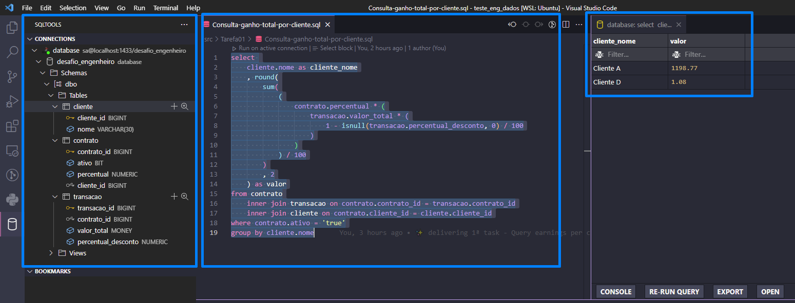

# Teste - Engenharia de Dados (Short Track)

Teste técnico para posições em Engenharia de Dados (short track)

O seguinte teste tem por premissa ser um problema base (Ref. <a href="https://teaching.cornell.edu/teaching-resources/engaging-students/problem-based-learning">problem based learning</a>) de modo que você pode usá-lo como achar adequado tendo em vista a demonstração de seus conhecimentos técnicos.

## Tarefa 01

Sua primeira tarefa consiste em escrever uma aplicação para calcular o ganho total da empresa, o qual é obtido a partir da taxa administrativa do serviço de cartão de crédito para seus clientes. Esse ganho é calculado sobre um percentual das transações de cartão de crédito realizadas por eles. O cálculo é baseado no conjunto de dados abaixo, transacao, contrato e cliente da <a href="https://drive.google.com/file/d/1lA2eLHNMoMpApPGz6h7WQpphT9URWxB1/view?usp=sharing">Figura 1</a>.

O resultado esperado é uma consulta que retorne o ganho total da empresa por cliente conforme abaixo:

| cliente_nome | valor |
|--------------|-------|
| Cliente A | 1.198,77 |
| Cliente D | 1,08     |


Utilize o script de criação do banco de dados e tabelas:

``` sql
create database desafio_engenheiro
go
use desafio_engenheiro
go
create table cliente (
cliente_id bigint primary key not null identity(1,1),
nome varchar(30) not null
)
go
insert cliente values ('Cliente A')
insert cliente values ('Cliente B')
insert cliente values ('Cliente C')
insert cliente values ('Cliente D')
go
create table contrato (
contrato_id bigint primary key not null identity(1,1),
ativo bit not null,
percentual numeric(10,2) not null,
cliente_id bigint not null foreign key references cliente(cliente_id)
)
go
insert into contrato values (1, 2, 1)
insert into contrato values (0, 1.95, 1)
insert into contrato values (1, 1, 2)
insert into contrato values (1, 3, 4)
go

create table transacao (
transacao_id bigint primary key not null identity(1,1),
contrato_id bigint not null foreign key references contrato(contrato_id),
valor_total money not null,
percentual_desconto numeric(10,2) null
)
go
insert into transacao values (1, 3000, 6.99)
insert into transacao values (2, 4500, 15)
insert into transacao values (1, 57989, 1.45)
insert into transacao values (4, 1, 0)
insert into transacao values (4, 35, null)
go
```

---

## Objetivo
Consultar ganhos agrupado por cliente.

## Recursos utilizados


- [WSL - Subsistema do Windows para Linux](https://learn.microsoft.com/pt-br/windows/wsl/about)
    - O Subsistema do Windows para Linux permite que os desenvolvedores executem um ambiente GNU/Linux, incluindo a maioria das ferramentas de linha de comando, utilitários e aplicativos, diretamente no Windows, sem modificações e sem a sobrecarga de uma máquina virtual tradicional ou instalação dualboot.

- [Ubuntu - Imagem para WSL](https://ubuntu.com/wsl)
    - Sistema operacioanal GNU/Linux

- [VirtualEnv](https://virtualenv.pypa.io/en/latest/)
    - Para isolar o projeto em um ambiente de desevolvimento dedicado.

- [DotEnv (.env)](https://www.dotenv.org/)
    - Para armazenar as variáveis de ambiente e deixar dados sensíveis do projeto exposto (usuário e senha, por exemplo).

- [Git](https://git-scm.com/) e [Github](https://github.com/)
    - Git para fazer o versionamento do projeto e GitHub para hospedar e compartilhar o projeto.

- [Docker](https://docs.docker.com/engine/)
    - Docker é uma plataforma aberta para desenvolvimento, envio e execução de aplicativos. O Docker permite separar seus aplicativos de sua infraestrutura para que você possa entregar software rapidamente.

- [Docker-Compose](https://docs.docker.com/compose/)
    - Compose é uma ferramenta para definir e executar aplicativos Docker com vários contêineres. Com o Compose, você usa um arquivo YAML para configurar os serviços do seu aplicativo. Então, com um único comando, você cria e inicia todos os serviços da sua configuração.

- [SQLTools](https://marketplace.visualstudio.com/items?itemName=mtxr.sqltools)
    - Extensão para Microsoft Visual Studio Code para se conectar a instância do SGBD SQL Server

## Resolução

### SQL Server e Docker Compose
Para a primeira entrega, que consiste em uma consulta para obter os ganhos agrupados por cliente, utilizamos o Docker e o Docker Compose para subir 2 imagens e então criar um banco de dados e as tabelas no SQL Server.
 
 - Windows SQL Server
    - Para execução do SGBD SQL Server.

- MSSQL-TOOLS
    -  Para execução do sqlcmd para execução de scripts e comandos SQL a partir de linha de comando.

#### **Arquivo Docker Compose**
A seguir temos o arquivo que irá definir e executar as imagens necessárias para a criação do banco de dados e executar as consultas.

``` yaml
# file: docker-compose.yml

version: '2.2'

services:
  sqlserver:
    image: mcr.microsoft.com/mssql/server:2022-latest
    env_file:
      - .env
    environment:
      SA_PASSWORD: ${SA_PASSWORD}
      ACCEPT_EULA: "Y"
      MSSQL_PID: "Developer"
    ports:
      - "1433:1433"
  mssqltools:
    env_file:
      - .env
    image: mcr.microsoft.com/mssql-tools
    depends_on:
      - sqlserver
    volumes:
      - ./create-db-and-tables.sql:/tmp/create-db-and-tables.sql
      - ./init-database.sh:/tmp/init-database.sh
    command: /bin/bash ./tmp/init-database.sh
```
### Execução
Antes de executar o docker composes para subir os serviços, precisamos mudar a permisão do arquivo `create-db-and-tables.sql` para que seja permitido a execução dentro do container, para isso basta executar o seguinte comando:

``` bash
chmod +x ./create-db-and-tables.sql
```

Script para ser executado pelo docker-compose assim que o subir os serviço:
``` bash
# file: create-db-and-tables.sql

/opt/mssql-tools/bin/sqlcmd -S sqlserver -U sa -P ${SA_PASSWORD} -d master -i /tmp/create-db-and-tables.sql
```

Execução dos containeres a partir do docker-compose:
``` bash
docker run -it mcr.microsoft.com/mssql-tools
```
Assim que o container estive em execução e o banco de dados e as tabelas criadas e populadas, podemos entrar no modo interativo do container que possui a ferramenta sqlcmd para consultar os dados:

``` bash
docker-compose run mssqltools bash
```

Logo em seguida podemos acessar o sqlcmd com o comando:

``` bash
sqlcmd -S sqlserver -U sa -P ${SA_PASSWORD}
```
A partir daqui podemos executar as queries. No entanto, para facilitar a execução e visualização dos dados, utilzaremos aqui o SQLTools, que vai nos permitir conectar no banco que estamos servido por meio do container.
Com essa extensão é possível escrever um arquivo com a nossa query e teremos uma visualização amigável dos dados:



Query para obter o resultado esperado:

``` sql
-- file: Consulta-ganho-total-por-cliente.sql

select 
    cliente.nome as cliente_nome
    , round(
        sum(
            (
                contrato.percentual * (
                    transacao.valor_total * (
                        1 - isnull(transacao.percentual_desconto, 0) / 100
                    )
                )
            ) / 100
        )
        , 2
    ) as valor
from contrato
    inner join transacao on contrato.contrato_id = transacao.contrato_id
    inner join cliente on contrato.cliente_id = cliente.cliente_id
where contrato.ativo = 'true'
group by cliente.nome
```


