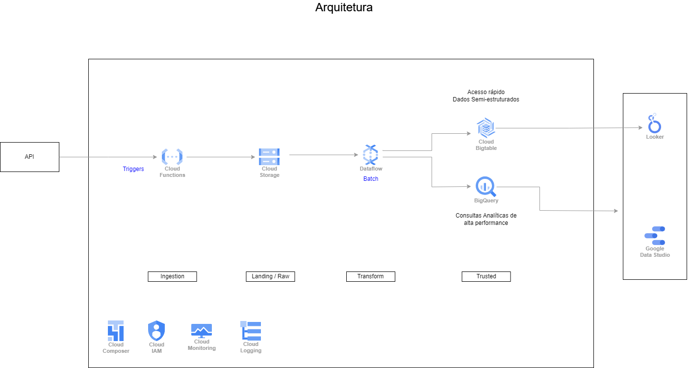
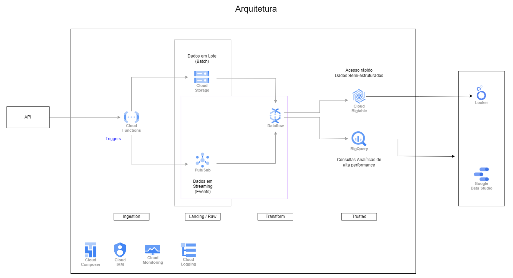

# Tarefa 04
---
A quarta tarefa consiste consumir os Json das notas fiscais que são disponibilizados em uma API. Como você utilizaria as tecnologias da GCP para ingerir, transformar e, eventualmente, carregar esses dados em um BigTable? O quarto entregável consiste na construção de uma arquitetura de ingestão dos dados de nota fiscal do entregável anterior (como visto [aqui](https://www.crystalloids.com/hs-fs/hubfs/Screenshot%202022-02-04%20at%2009-44-40-png.png?width=1232&name=Screenshot%202022-02-04%20at%2009-44-40-png.png"), a qual deve atender aos seguintes pontos:

- Esquemas de fluxo de dados;
- Descrições de funcionamento (se necessário);
- Nomes de tecnologias em ecossistema GCP (serviços, conectores, bibliotecas e módulos).

## Diagrama

## Fluxo

### 1. Consumo da API
Considerei utilizar o Cloud Functions que é um serviço de computação sem servidor (serverless), o que nos trás a vantagem de não ter que provisonar e gerenciar o serviço. 
O Cloud Functions vai nos permitir executar códigos em resposta a determinados eventos, que nosso caso, uma chamada da API externa. Toda vez que um lote de dados estiver disponível para consumo o serviço da API externa irá enviar um evento de gatilho (trigger) para o cloud functions, que consequentemente irá executar a função que vai processar os arquivos. Dentro da função teremos um script que pode ser escrito em divesas linguagens, o que nos dá flexibilidade ao processo, pois podemos escolher qual queremos utilizar entre Python, Go, Java, Javascript, entre outras.
Vale ressaltar que o Cloud Functions é gerenciado pelo Google, e as função podem ser dimensionadas para atender um baixo volume de requisições ou até mesmo milhares por dia sem a necessidade de configurar os recursos para atender a demanda.

### 2. Repositório temporário para os dados
Vamos utilizar o Cloud Storage que é um serviço de armazenamento de objetos, e iremos utilizá-lo para armazenar os arquivos processados pelo Cloud Functions. Esta camanda pode ser chamada de Raw, pois possuem os dados brutos dentro da estrutura interna (dados réplicas do serviço externo).

### 3. Processamento unificado
O Dataflow é um ferramenta que possui capacidade para processar e tranformar dados tanto em lote quanto streaming. Através dele podemos fazer ETL (Extract, Transform and Load).
Ele cabe bem para quando precisamos fazer ingestão ou replicação de dados, além de poder potencializar a perfomance de painéis de business intelligence.
O Dataflow o serviço Apache Beam gerenciado pelo Google, então temos os mesmo recursos que encontramos no Apache.
Dessa forma, se necessário pode aplicar transformações nos dados dos arquivos json, garantindo a execução de transformação em cada elemento de forma paralelizada, antes de realizar escrita no destino que desejamos. No nosso caso, o BigTable.

### 4. Escrita dos dados semi-estruturado no BigTable
O BigTable é um banco de dados NoSql (Not Only SQL) que utiliza a estrutura de chave valor para armazenar os dados e fornece grande capacidade operações de leitura e baixa latência para gravação dos dados.

### 5. Orquestração dos serviços
Considerei utilizar o Cloud Composer, que é o Airflow como serviço gerenciado pelo Google, o que irá nos trazer vantagens uma vez que não precisamos nos preocupar com o provisionamento e gerenciamento do orquestrador de todo o nosso pipeline. Teremos diversas vantagem no uso de Composer, ainda mais considerando que nosso pipeline será executado em lotes, então podemos configurar para que o serviço esteja ativo somente quando for necessário executar o processamentos dos dados. Sendo assimm teremos um custo reduzido, pois a forma de cobrança do Composer é por tempo de atividade e os recursos necessários para a computação.

### 6. Governaça e Gestão de Acesso
Incluí no fluxo o Cloud IAM para nos permitir gerenciar identidades e acessos ao projeto.
Por meio dele, definimos uma identidade, que pode ser um usuário ou conta de serviço (entre outros) e definimos um papel (role), que define o que este usuário e/o conta de serviço terá acesso dentro do projeto.

### 7. Monitoramento e Loggin
Adicionalmente tenho como sugestão os recursos de monitoramento e log do nosso projeto, dessa forma podemos monitorar a saúde da execução (sustenção) do nosso pipeline. Podemos criar painéis de monitoramento com esses dados e até criar alertas.

### Consideração adicional
Caso exista a possibilidade/necessidade de executar um pipeline em modo de streaming de dados, deixo a seguir uma outra sugestão de arquitetura para atendê-la.

O que diferencia aqui, é que teremos uma perna depois do Cloud Function que irá capturar os eventos por meio do Pub Sub, é que um serviço de mensageria assíncrono.
No entanto, o orquestrador do pipeline de modo streaming deveria ser o dataflow, tendo em vistar que o composer foi concebido para orquestrar processamentos em batch idealmente.
É extremamente importante pensar em custo, já que quando falamos de dados em tempo real, devemos considerar um custo elevado comparado ao processamento em lote.

### Versionamento do projeto
Idealmente o projeto deve ser versionado com as ferramentas com este propósito, como Git, e hospedado em um servidor como Github ou GitLab.

### Backlog
Se tivesse mais tempo, o que você faria para melhorar a sua solução?

Com mais tempo, esboçaria a camada delivery, demonstrando o motivo do Bigquery, Looker e Data Studio estarem sendo considerados no diagrama.

Poderia sugerir o uso ferramentas Data Builders como DBT, ou o propróio Dataform que foi incorporado como recurso nativo dentro da stack do GCP. Essa ferramentas fariam o etapa de transformação para a camada delivery

#### Definição de Dataowner
Seguinte o conceito de govença, faria todo o projeto pautado no levantamento prévio de dataowners do projeto, permitindo assim a melhor gestão e responsabilidade sobre os dados.

